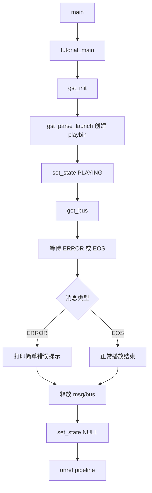

# Basic Tutorial 1: Hello World 代码讲解

本文讲解 [src/basic-tutorial/basic-tutorial-1.c](../../src/basic-tutorial/basic-tutorial-1.c)，对应 GStreamer 官方教程：
<https://gstreamer.freedesktop.org/documentation/tutorials/basic/hello-world.html?gi-language=c>

这是 GStreamer Basic Tutorial 系列的第一篇。虽然名字叫 Hello World，但多媒体框架的 “Hello World” 不是打印字符串，而是播放一段网络视频。

官方教程强调：这份代码看起来有一些清理逻辑，但真正做核心工作的只有几行：

1. 初始化 GStreamer。
2. 用字符串创建播放管线。
3. 设置为播放状态。
4. 等待错误或播放结束。

## 这个 Demo 做了什么

程序播放远程 WebM 文件：

```text
https://gstreamer.freedesktop.org/data/media/sintel_trailer-480p.webm
```

运行后，如果网络和插件环境正常，会弹出视频窗口，同时播放音频。

它使用的是 `playbin`，所以代码里没有手动创建 source、demuxer、decoder、converter、audio sink、video sink。所有内部播放管线都交给 `playbin` 自动完成。

可以把它理解成：

```text
Application
  -> playbin uri=https://...
      -> 自动创建网络 source
      -> 自动识别容器
      -> 自动解复用
      -> 自动解码音视频
      -> 自动选择音频/视频输出
```

## main 与 tutorial_main

源码有两个入口：

```c
int
tutorial_main (int argc, char *argv[])
```

和：

```c
int
main (int argc, char *argv[])
```

普通平台上，`main()` 直接调用：

```c
return tutorial_main (argc, argv);
```

macOS 上则使用：

```c
gst_macos_main ((GstMainFunc) tutorial_main, argc, argv, NULL);
```

这是为了适配 macOS 应用主线程和图形系统的要求。Linux/Windows 上可以先忽略这部分，把 `tutorial_main()` 当成真正的主逻辑。

## 初始化 GStreamer

```c
gst_init (&argc, &argv);
```

这是所有 GStreamer 程序通常要做的第一件事。

`gst_init()` 会：

- 初始化 GStreamer 内部数据结构。
- 扫描并加载可用插件。
- 处理 GStreamer 自己支持的命令行参数。

把 `argc` 和 `argv` 传进去的好处是：程序天然支持 GStreamer 标准命令行选项，例如调试相关参数。

## 用 gst_parse_launch 创建 Pipeline

```c
pipeline =
    gst_parse_launch
    ("playbin uri=https://gstreamer.freedesktop.org/data/media/sintel_trailer-480p.webm",
    NULL);
```

这是本 demo 的核心。

`gst_parse_launch()` 接收一段类似 `gst-launch-1.0` 的管线描述字符串，并把它解析成真实的 GStreamer element 或 pipeline。

这行代码等价于命令行运行：

```sh
gst-launch-1.0 playbin uri=https://gstreamer.freedesktop.org/data/media/sintel_trailer-480p.webm
```

这里的字符串只有一个 element：

```text
playbin uri=...
```

因为 `playbin` 本身就是一个高级 bin，内部会自动搭建完整播放管线。

## playbin 是什么

`playbin` 是 GStreamer 提供的高级播放器 element。

它既像 source，也像 sink，更准确地说，它内部包含了一个完整播放器管线。

你只要告诉它：

```text
uri = 要播放的媒体地址
```

它就会自动完成：

- 根据 URI 选择合适 source。
- 下载或读取媒体数据。
- typefind，识别媒体类型。
- 选择 demuxer 拆容器。
- 选择 decoder 解码音视频。
- 插入必要 converter。
- 选择音频和视频 sink。

优点是代码极少，适合快速播放和播放器原型。

缺点是内部结构不透明，如果要精细控制每个环节，需要后续教程里的手动 pipeline、动态 pad、caps、bus 等知识。

## 启动播放

```c
gst_element_set_state (pipeline, GST_STATE_PLAYING);
```

GStreamer element 有状态。播放不会因为创建了 pipeline 就自动开始，必须把它切到 `PLAYING`。

常见状态包括：

| 状态 | 含义 |
| --- | --- |
| `GST_STATE_NULL` | 初始/释放状态 |
| `GST_STATE_READY` | 准备资源 |
| `GST_STATE_PAUSED` | 已经 preroll，等待播放 |
| `GST_STATE_PLAYING` | 按时钟实际播放 |

这篇教程暂时不检查 `gst_element_set_state()` 的返回值。后续教程会逐步补上更完整的错误处理。

## 等待 ERROR 或 EOS

```c
bus = gst_element_get_bus (pipeline);
msg =
    gst_bus_timed_pop_filtered (bus, GST_CLOCK_TIME_NONE,
    GST_MESSAGE_ERROR | GST_MESSAGE_EOS);
```

GStreamer element 会通过 bus 向应用发送消息。

这里程序只关心两种消息：

| 消息 | 含义 |
| --- | --- |
| `GST_MESSAGE_ERROR` | 播放发生错误 |
| `GST_MESSAGE_EOS` | End Of Stream，播放结束 |

`GST_CLOCK_TIME_NONE` 表示无限等待，直到收到指定消息为止。

也就是说，程序会一直阻塞在这里，直到：

- 视频播放完毕，收到 EOS。
- 播放失败，收到 ERROR。

这就是最简单的命令行式播放程序结构。

## 错误处理

```c
if (GST_MESSAGE_TYPE (msg) == GST_MESSAGE_ERROR) {
  g_printerr ("An error occurred! Re-run with the GST_DEBUG=*:WARN "
      "environment variable set for more details.\n");
}
```

这篇教程只做了最简单的错误提示，没有解析具体错误内容。

如果出错，可以用：

```sh
GST_DEBUG=*:WARN ./bin/basic-tutorial-1
```

或者更常用：

```sh
GST_DEBUG=2 ./bin/basic-tutorial-1
```

后续 Basic Tutorial 2/3/4 会逐步展示更完整的 bus message 解析方式。

## 资源清理

```c
gst_message_unref (msg);
gst_object_unref (bus);
gst_element_set_state (pipeline, GST_STATE_NULL);
gst_object_unref (pipeline);
```

清理顺序很重要：

1. `gst_message_unref(msg)`：释放 bus 返回的消息。
2. `gst_object_unref(bus)`：释放 `gst_element_get_bus()` 得到的 bus 引用。
3. `gst_element_set_state(pipeline, GST_STATE_NULL)`：让 pipeline 停止并释放内部资源。
4. `gst_object_unref(pipeline)`：释放 pipeline 对象本身。

官方教程特别提醒：退出前应该把 pipeline 设置回 `GST_STATE_NULL`。这是释放设备、文件句柄、网络连接、线程等资源的关键步骤。

## 程序运行流程图



## 这篇教程中的关键 API

| API / 概念 | 作用 |
| --- | --- |
| `gst_init()` | 初始化 GStreamer |
| `gst_parse_launch()` | 从字符串创建 pipeline 或 element |
| `playbin` | 高级自动播放器 element |
| `uri` 属性 | 指定要播放的媒体地址 |
| `gst_element_set_state()` | 切换 element/pipeline 状态 |
| `GST_STATE_PLAYING` | 开始播放 |
| `gst_element_get_bus()` | 获取 pipeline 的 bus |
| `gst_bus_timed_pop_filtered()` | 阻塞等待指定类型消息 |
| `GST_MESSAGE_ERROR` | 错误消息 |
| `GST_MESSAGE_EOS` | 播放结束消息 |
| `gst_message_unref()` | 释放消息 |
| `gst_object_unref()` | 释放 GStreamer 对象引用 |
| `GST_STATE_NULL` | 停止并释放 pipeline 资源 |

## 编译

本仓库已经提供统一 `Makefile`，可以编译单个教程：

```sh
make basic-tutorial-1
```

等价的手动编译命令：

```sh
gcc src/basic-tutorial/basic-tutorial-1.c -o bin/basic-tutorial-1 \
  `pkg-config --cflags --libs gstreamer-1.0`
```

需要目标机器安装 `gstreamer-1.0` 对应的开发包。

## 运行

```sh
./bin/basic-tutorial-1
```

如果网络和插件正常，会打开窗口播放视频。

如果没有画面或报错，可先检查：

```sh
gst-inspect-1.0 playbin
gst-discoverer-1.0 https://gstreamer.freedesktop.org/data/media/sintel_trailer-480p.webm -v
GST_DEBUG=2 ./bin/basic-tutorial-1
```

## 这篇教程的核心思想

Basic Tutorial 1 的重点不是教你掌握完整 GStreamer，而是给一个最小可运行程序：

```text
gst_init
  -> gst_parse_launch("playbin uri=...")
  -> set_state(PLAYING)
  -> wait ERROR/EOS
  -> cleanup
```

它展示了 GStreamer 最基础的开发闭环：

- 初始化框架。
- 创建 pipeline。
- 启动播放。
- 通过 bus 等待结果。
- 正确释放资源。

后续教程会逐步把 `playbin` 这个黑盒拆开，学习手动搭建管线、处理动态 pad、查询时间、处理 caps、调试和平台适配。

## 可尝试的改动

- 把 URI 换成本地文件，例如 `file:///home/user/video.mp4`。
- 把 URI 故意写错，观察错误提示和 `GST_DEBUG=2` 输出。
- 用 `gst-launch-1.0 playbin uri=...` 对比命令行效果。
- 用 `GST_DEBUG_DUMP_DOT_DIR` 导出 `playbin` 内部管线图。
- 在 `gst_element_set_state()` 后检查返回值，补上更完整的错误处理。

