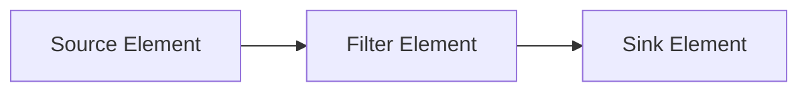
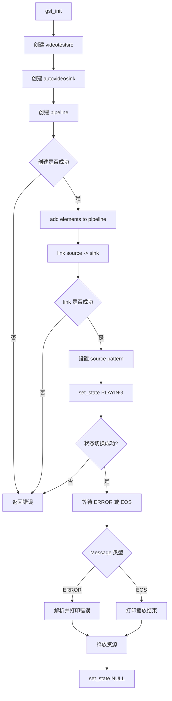

# Basic Tutorial 2: GStreamer Concepts 代码讲解

本文讲解 [src/basic-tutorial/basic-tutorial-2.c](../../src/basic-tutorial/basic-tutorial-2.c)，对应 GStreamer 官方教程：
<https://gstreamer.freedesktop.org/documentation/tutorials/basic/concepts.html?gi-language=c>

Basic Tutorial 1 使用 `playbin` 自动搭建播放管线；Basic Tutorial 2 开始把黑盒拆开，手动创建 element、放入 pipeline、连接 element，并解析 bus 上的错误消息。

这篇教程的目标是掌握 GStreamer 最基础的几个概念：

- 什么是 element。
- 如何创建 element。
- 如何创建 pipeline。
- 如何把 element 加入 pipeline。
- 如何 link element。
- 如何设置 element 属性。
- 如何监听 bus 并解析错误消息。

## 这个 Demo 做了什么

程序创建一个非常简单的视频测试管线：

```text
videotestsrc -> autovideosink
```

含义：

- `videotestsrc` 生成测试视频图案。
- `autovideosink` 自动选择当前平台可用的视频输出方式，并打开窗口显示画面。

这次没有播放文件，也没有网络 URI。所有视频数据都由 `videotestsrc` 直接生成。

## 和 Tutorial 1 的区别

Tutorial 1：

```text
playbin uri=https://...
```

特点是自动化程度高。应用只告诉 GStreamer 播放什么，剩下交给 `playbin`。

Tutorial 2：

```text
videotestsrc -> autovideosink
```

特点是应用自己显式创建 element，自己把它们放进 pipeline，自己连接它们。

这就是从“使用播放器黑盒”到“理解管线结构”的第一步。

## Element 是什么

Element 是 GStreamer 的基本构建块。

媒体数据从 source element 产生，经过 filter element 处理，最后到 sink element 消费。



本 demo 只有 source 和 sink，没有中间 filter：


常见类型：

| 类型 | 作用 | 例子 |
| --- | --- | --- |
| Source | 产生数据 | `videotestsrc`、`audiotestsrc`、`filesrc` |
| Filter | 转换或处理数据 | `videoconvert`、`audioconvert`、`videoscale` |
| Sink | 消费数据 | `autovideosink`、`autoaudiosink`、`filesink` |

## 创建 Element

```c
source = gst_element_factory_make ("videotestsrc", "source");
sink = gst_element_factory_make ("autovideosink", "sink");
```

`gst_element_factory_make()` 的两个参数：

| 参数 | 含义 |
| --- | --- |
| 第一个参数 | element 类型，也就是 factory 名 |
| 第二个参数 | 当前实例的名字 |

例如：

```c
gst_element_factory_make ("videotestsrc", "source");
```

表示创建一个 `videotestsrc` 类型的 element，并把这个实例命名为 `source`。

给 element 命名有两个好处：

- 调试日志更容易读。
- 如果没有保存指针，也可以通过名字找回。

如果第二个参数传 `NULL`，GStreamer 会自动生成唯一名字。

## videotestsrc

`videotestsrc` 是 source element，用来生成测试视频图案。

它适合：

- 验证视频输出链路是否可用。
- 调试视频 filter。
- 排除输入文件、网络、摄像头等外部因素。

真实应用里不常用它作为实际输入，但教程和调试中非常常见。

## autovideosink

`autovideosink` 是 sink element，用来显示视频。

它会根据当前平台和插件环境自动选择合适的视频 sink，比如 Linux 上可能选择 X11、GL、Wayland 相关 sink，Windows 上可能选择 Direct3D 相关 sink。

好处是：

- 代码更跨平台。
- 不需要手动判断当前系统该用哪个 video sink。

如果要强制指定平台 sink，可以参考 Platform-specific Elements 教程。

## 创建 Pipeline

```c
pipeline = gst_pipeline_new ("test-pipeline");
```

`GstPipeline` 是一种特殊的 `GstBin`。Bin 是用来容纳多个 element 的容器，而 pipeline 是顶层 bin，负责额外的时钟、状态和 bus 管理。

为什么 element 要放进 pipeline？

- pipeline 管理所有子 element 的状态。
- pipeline 提供统一 bus。
- pipeline 管理播放时钟。
- pipeline 负责整体生命周期。

所以手动搭管线时，一般流程是：

```text
create elements
create pipeline
add elements to pipeline
link elements
set pipeline state
```

## 检查创建是否成功

```c
if (!pipeline || !source || !sink) {
  g_printerr ("Not all elements could be created.\n");
  return -1;
}
```

这一步很重要。element 创建失败通常意味着：

- 插件没有安装。
- factory 名写错。
- 当前平台不支持某个 element。

可以用：

```sh
gst-inspect-1.0 videotestsrc
gst-inspect-1.0 autovideosink
```

检查目标机器上是否有对应 element。

## 把 Element 加入 Pipeline

```c
gst_bin_add_many (GST_BIN (pipeline), source, sink, NULL);
```

`gst_bin_add_many()` 把多个 element 加入同一个 bin。

这里要把 `pipeline` 强转成 `GstBin`：

```c
GST_BIN (pipeline)
```

因为 pipeline 是 bin 的一种，bin 支持添加子 element。

参数列表以 `NULL` 结尾，这是 GLib/GStreamer C API 中常见的可变参数写法。

## 连接 Element

```c
if (gst_element_link (source, sink) != TRUE) {
  g_printerr ("Elements could not be linked.\n");
  gst_object_unref (pipeline);
  return -1;
}
```

`gst_element_link(source, sink)` 表示：

```text
source 的 src pad -> sink 的 sink pad
```

连接方向必须符合数据流方向，不能反过来。

也就是说：

```c
gst_element_link (source, sink);
```

是对的，而：

```c
gst_element_link (sink, source);
```

是不对的。

还有一个关键点：只有在同一个 bin/pipeline 里的 element 才能 link。所以要先 `gst_bin_add_many()`，再 `gst_element_link()`。

## Pad 与 Link 的关系

虽然代码里写的是 element link，但底层真正连接的是 pad。


`videotestsrc` 有 source pad，`autovideosink` 有 sink pad。GStreamer 会根据它们的 pad caps 判断能不能连接。

如果 link 失败，常见原因是：

- 上下游 caps 不兼容。
- 缺少转换 element，例如 `videoconvert`。
- element 不在同一个 pipeline 中。

后续 Basic Tutorial 6 会系统讲 caps。

## 设置 Element 属性

```c
g_object_set (source, "pattern", 0, NULL);
```

GStreamer element 基于 GObject，因此可以通过 GObject 属性系统配置行为。

这里设置的是 `videotestsrc` 的 `pattern` 属性，用来控制测试图案类型。

`g_object_set()` 的形式是：

```c
g_object_set (object, "property-name", value, NULL);
```

也可以一次设置多个属性：

```c
g_object_set (source,
    "pattern", 0,
    "is-live", TRUE,
    NULL);
```

想查看某个 element 有哪些属性：

```sh
gst-inspect-1.0 videotestsrc
```

可以尝试不同 pattern：

```sh
gst-launch-1.0 videotestsrc pattern=snow ! autovideosink
gst-launch-1.0 videotestsrc pattern=ball ! autovideosink
```

## 启动 Pipeline

```c
ret = gst_element_set_state (pipeline, GST_STATE_PLAYING);
if (ret == GST_STATE_CHANGE_FAILURE) {
  g_printerr ("Unable to set the pipeline to the playing state.\n");
  gst_object_unref (pipeline);
  return -1;
}
```

和 Tutorial 1 相比，这里开始检查 `gst_element_set_state()` 的返回值。

如果返回 `GST_STATE_CHANGE_FAILURE`，说明 pipeline 无法进入播放状态。

可能原因：

- element 初始化失败。
- sink 无法打开窗口或设备。
- caps negotiation 失败。
- 插件内部错误。

## 等待 ERROR 或 EOS

```c
bus = gst_element_get_bus (pipeline);
msg =
    gst_bus_timed_pop_filtered (bus, GST_CLOCK_TIME_NONE,
    GST_MESSAGE_ERROR | GST_MESSAGE_EOS);
```

这和 Tutorial 1 类似：程序阻塞等待错误或播放结束。

但这里的 `videotestsrc` 默认会一直生成视频数据，通常不会自然 EOS。因此这个程序正常情况下会一直运行，直到你关闭窗口或中断程序；如果发生错误，则会收到 `GST_MESSAGE_ERROR`。

## 解析 Bus Message

```c
switch (GST_MESSAGE_TYPE (msg)) {
  case GST_MESSAGE_ERROR:
    ...
    break;
  case GST_MESSAGE_EOS:
    ...
    break;
  default:
    ...
    break;
}
```

这篇教程正式引入 bus message 解析。

Bus 是 GStreamer element 向应用线程发送消息的通道。媒体 streaming 可能发生在其他线程中，bus 会把消息安全地送到应用侧。

## 解析 ERROR 消息

```c
gst_message_parse_error (msg, &err, &debug_info);
g_printerr ("Error received from element %s: %s\n",
    GST_OBJECT_NAME (msg->src), err->message);
g_printerr ("Debugging information: %s\n",
    debug_info ? debug_info : "none");
g_clear_error (&err);
g_free (debug_info);
```

`gst_message_parse_error()` 会取出：

| 输出 | 含义 |
| --- | --- |
| `GError *err` | 面向用户的错误信息 |
| `debug_info` | 面向开发者的调试信息 |

`GST_OBJECT_NAME(msg->src)` 可以告诉你哪个 element 发出了错误。

用完后要释放：

```c
g_clear_error (&err);
g_free (debug_info);
```

这比 Tutorial 1 只提示 “An error occurred” 更有用。

## EOS 消息

```c
case GST_MESSAGE_EOS:
  g_print ("End-Of-Stream reached.\n");
  break;
```

EOS 表示 End Of Stream，也就是数据流结束。

对于文件播放，播放到结尾会收到 EOS。对于 `videotestsrc` 这种无限测试源，默认不会自然结束。

## 资源清理

```c
gst_message_unref (msg);
gst_object_unref (bus);
gst_element_set_state (pipeline, GST_STATE_NULL);
gst_object_unref (pipeline);
```

清理顺序：

1. 释放 bus message。
2. 释放 bus 引用。
3. 把 pipeline 设置为 `NULL`，停止并释放内部运行资源。
4. 释放 pipeline。

因为 source 和 sink 都已经加入 pipeline，释放 pipeline 时会连带释放它们。

## 程序流程图



## 这篇教程中的关键 API

| API / 概念 | 作用 |
| --- | --- |
| `gst_element_factory_make()` | 根据 factory 名创建 element |
| `videotestsrc` | 生成测试视频图案 |
| `autovideosink` | 自动选择视频输出 |
| `gst_pipeline_new()` | 创建空 pipeline |
| `GstBin` | 容纳多个 element 的容器 |
| `gst_bin_add_many()` | 把多个 element 加入 bin/pipeline |
| `gst_element_link()` | 连接两个 element |
| `g_object_set()` | 设置 GObject 属性 |
| `gst_element_set_state()` | 切换 pipeline 状态 |
| `GstStateChangeReturn` | 状态切换返回值 |
| `gst_element_get_bus()` | 获取 pipeline bus |
| `gst_bus_timed_pop_filtered()` | 等待指定 bus 消息 |
| `GST_MESSAGE_TYPE()` | 获取消息类型 |
| `gst_message_parse_error()` | 解析错误消息 |
| `GST_OBJECT_NAME()` | 获取对象名 |

## 编译

本仓库提供统一 `Makefile`：

```sh
make basic-tutorial-2
```

等价的手动编译命令：

```sh
gcc src/basic-tutorial/basic-tutorial-2.c -o bin/basic-tutorial-2 \
  `pkg-config --cflags --libs gstreamer-1.0`
```

## 运行

```sh
./bin/basic-tutorial-2
```

正常情况下会打开一个窗口显示测试图案。

如果 element 不存在或运行失败，可检查：

```sh
gst-inspect-1.0 videotestsrc
gst-inspect-1.0 autovideosink
GST_DEBUG=2 ./bin/basic-tutorial-2
```

## 练习建议

官方教程建议：在 source 和 sink 中间插入一个 video filter，比如 `vertigotv`。

管线概念上变成：

```text
videotestsrc -> vertigotv -> autovideosink
```

如果出现 negotiation 错误，可以尝试加入 `videoconvert`：

```text
videotestsrc -> vertigotv -> videoconvert -> autovideosink
```

这会引出后面 Basic Tutorial 6 的 caps negotiation 概念。

## 这篇教程的核心思想

Basic Tutorial 2 是 GStreamer 手动搭管线的起点。

你需要记住这条主线：

```text
create elements
  -> create pipeline
  -> add elements to pipeline
  -> link elements
  -> set properties
  -> set state PLAYING
  -> watch bus
  -> cleanup
```

它展示了 GStreamer 程序的基本骨架。后续教程几乎都是在这个骨架上继续扩展：动态 pad、caps、query、seek、queue、tee、appsrc/appsink、GUI 和调试工具。

