# GStreamer Basic Tutorial 系列知识图谱总结

本文对 GStreamer Basic Tutorial 系列做一次总览式总结。它不是逐篇复述，而是把整个系列抽象成一张知识图谱：核心概念、管线搭建模式、运行时控制、调试方法、常用 element 和平台选择之间如何关联。

相关官方教程入口：

- <https://gstreamer.freedesktop.org/documentation/tutorials/basic/>

本仓库已有分篇笔记：

- [Basic Tutorial 3: Dynamic Pipelines](./basic-tutorial-3-dynamic-pipelines.md)
- [Basic Tutorial 4: Time Management](./basic-tutorial-4-time-management.md)
- [Basic Tutorial 5: Toolkit Integration](./basic-tutorial-5-toolkit-integration.md)
- [Basic Tutorial 6: Media Formats and Pad Capabilities](./basic-tutorial-6-media-formats-and-pad-capabilities.md)
- [Basic Tutorial 7: Multithreading and Pad Availability](./basic-tutorial-7-multithreading-and-pad-availability.md)
- [Basic Tutorial 8: Short-cutting the Pipeline](./basic-tutorial-8-short-cutting-the-pipeline.md)
- [Basic Tutorial 9: Media Information Gathering](./basic-tutorial-9-media-information-gathering.md)
- [Basic Tutorial 10: GStreamer Tools](./basic-tutorial-10-gstreamer-tools.md)
- [Basic Tutorial 11: Debugging Tools](./basic-tutorial-11-debugging-tools.md)
- [Basic Tutorial 12: Streaming](./basic-tutorial-12-streaming.md)
- [Basic Tutorial 13: Playback Speed](./basic-tutorial-13-playback-speed.md)
- [Basic Tutorial 14: Handy Elements](./basic-tutorial-14-handy-elements.md)
- [Basic Tutorial 16: Platform-specific Elements](./basic-tutorial-16-platform-specific-elements.md)

## 一句话总览

GStreamer 的核心思想是：

```text
把媒体处理拆成 element，用 pad 连接成 pipeline，
让 buffer 在 pipeline 中流动，
让 caps 描述数据格式，
让 bus/message/event/query 管理运行时交互。
```

你写 GStreamer 程序时，始终在处理这几个问题：

| 问题 | 对应机制 |
| --- | --- |
| 数据从哪里来 | source element |
| 数据经过哪些处理 | filter / converter / encoder / decoder / muxer / demuxer |
| 数据到哪里去 | sink element |
| element 能不能连接 | pad + caps |
| pipeline 当前运行到什么状态 | state |
| 内部发生了什么 | bus message |
| 应用如何主动控制 pipeline | query / event |
| 复杂管线如何避免阻塞 | queue / multiqueue / threading |
| 怎么调试 | GST_DEBUG / gst-inspect / gst-launch / DOT graph |

## 知识图谱总览

原先把所有节点放在一张图里会太密，Markdown 预览时很难看清。这里拆成一个总索引和四张主题图：基础结构、连接与格式、运行时控制、工程化能力。阅读时可以先看总索引，再跳到对应主题图。

### 总索引

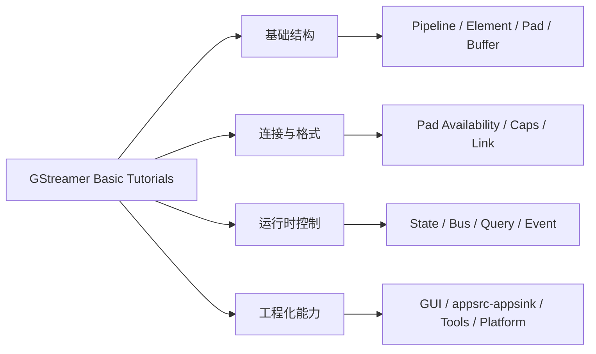

### 图 1: 基础结构

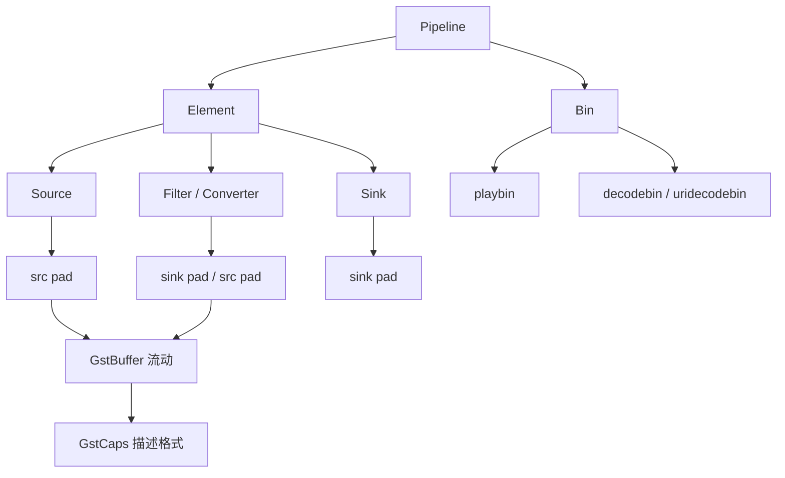

### 图 2: 连接与格式

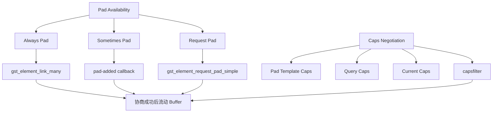

### 图 3: 运行时控制

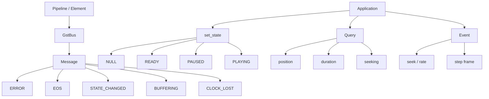

### 图 4: 工程化能力

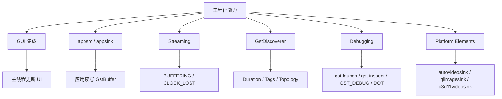

## 学习路径

整个 Basic Tutorial 系列可以理解成四层递进。

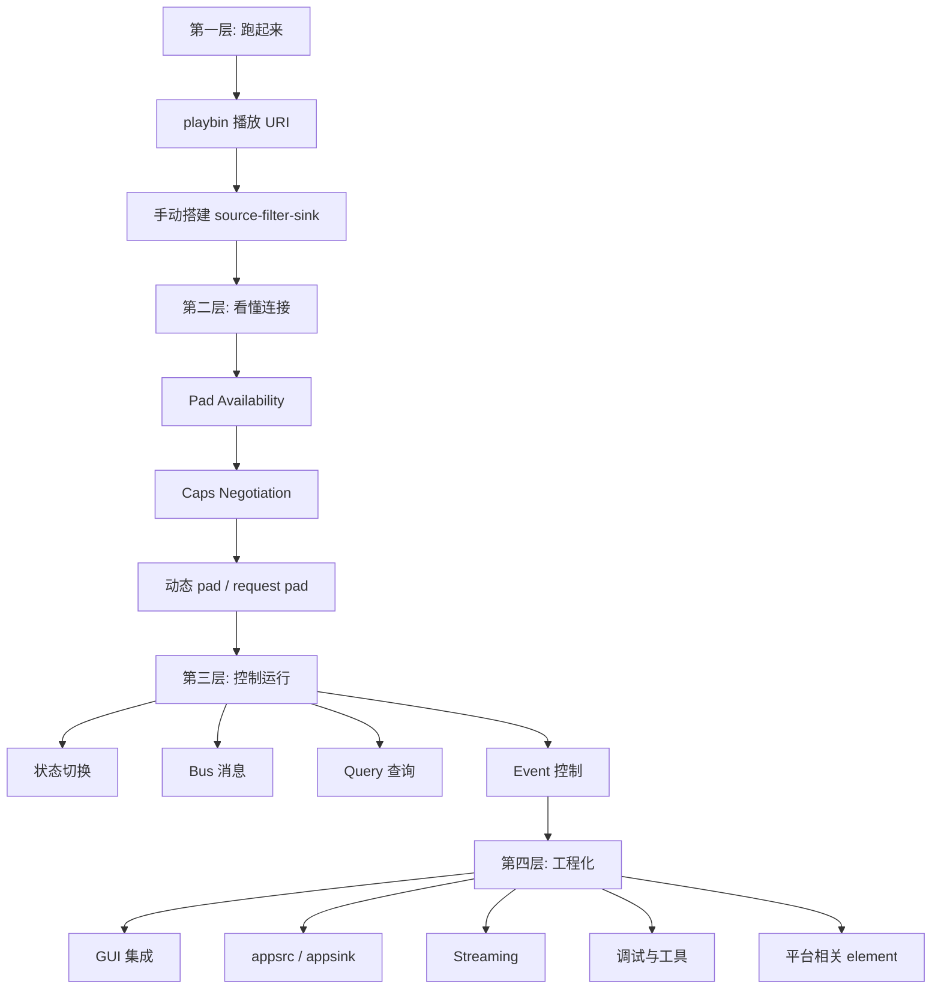

对应教程：

| 层级 | 教程 | 核心能力 |
| --- | --- | --- |
| 跑起来 | 1、2 | 用 `playbin` 和手动 element 搭建基础 pipeline |
| 看懂连接 | 3、6、7 | 动态 pad、caps、request pad、tee/queue |
| 控制运行 | 4、12、13 | position/duration、seek、buffering、playback rate |
| 工程化 | 5、8、9、10、11、14、16 | GUI、appsrc/appsink、discoverer、工具、调试、平台适配 |

## 核心概念图

### Pipeline / Element / Pad / Buffer

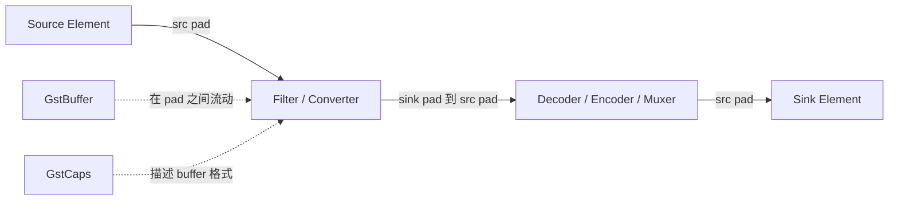

基本关系：

- `GstElement` 是处理单元。
- `GstPad` 是 element 的输入/输出端口。
- `GstBuffer` 是媒体数据块。
- `GstCaps` 描述 pad 上能传输的数据格式。
- `GstPipeline` 是包含多个 element 的顶层 bin。

### Source / Filter / Sink

```text
source: 产生数据
filter: 处理或转换数据
sink:   消费数据
```

例子：

```text
audiotestsrc -> audioconvert -> audioresample -> autoaudiosink
videotestsrc -> videoconvert -> autovideosink
filesrc -> decodebin -> videoconvert -> autovideosink
```

## 管线搭建模式

### 模式 1: playbin 黑盒播放

适合快速播放器。

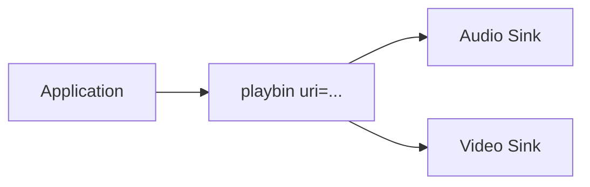

优点：

- 最少代码。
- 自动 source、demux、decode、convert、sink。
- 适合播放器原型和普通播放。

缺点：

- 内部结构复杂。
- 不适合精细控制每个处理环节。

C 代码常见写法：

```c
playbin = gst_element_factory_make ("playbin", "playbin");
g_object_set (playbin, "uri", uri, NULL);
gst_element_set_state (playbin, GST_STATE_PLAYING);
```

或者：

```c
pipeline = gst_parse_launch ("playbin uri=...", NULL);
```

### 模式 2: 手动搭建静态管线

适合结构明确、pad 都是 always pad 的简单场景。

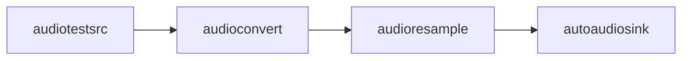

典型代码：

```c
source = gst_element_factory_make ("audiotestsrc", "source");
convert = gst_element_factory_make ("audioconvert", "convert");
resample = gst_element_factory_make ("audioresample", "resample");
sink = gst_element_factory_make ("autoaudiosink", "sink");

pipeline = gst_pipeline_new ("test-pipeline");
gst_bin_add_many (GST_BIN (pipeline), source, convert, resample, sink, NULL);
gst_element_link_many (source, convert, resample, sink, NULL);
```

关键点：

- 所有 element 必须先加入同一个 bin/pipeline，再 link。
- `gst_element_link_many()` 适合静态 pad 明确的链路。
- 转换类 element 可以增加 caps 兼容性。

### 模式 3: 动态 pad 管线

适合 `uridecodebin`、`decodebin`、demuxer 等运行时才知道输出流的 element。

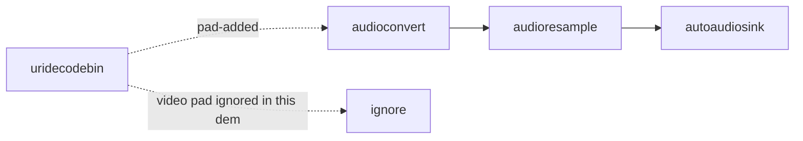

流程：

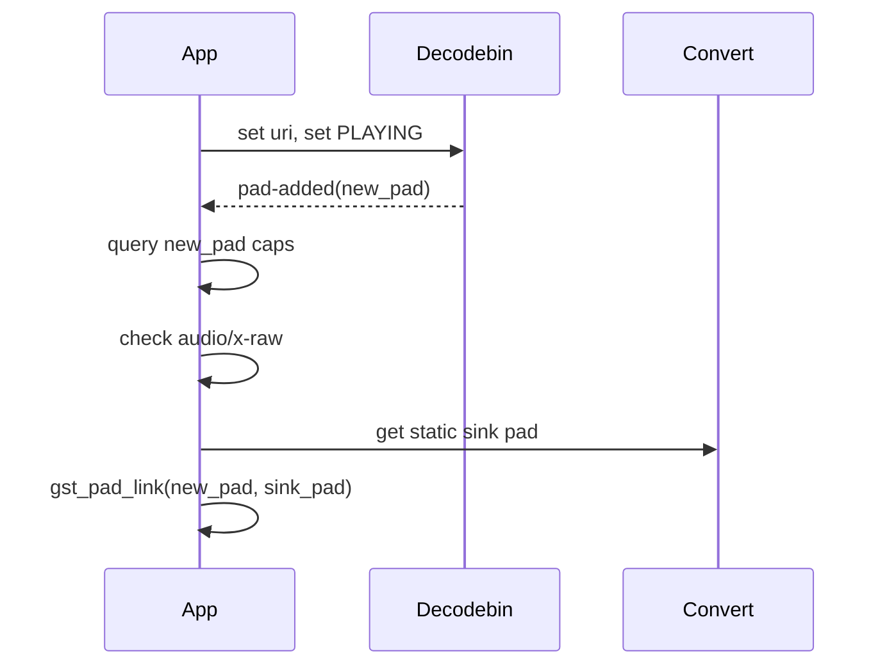

关键点：

- 不能在初始化时直接 link `uridecodebin -> audioconvert`。
- 监听 `pad-added`。
- 检查 caps，比如 `audio/x-raw`。
- 用 `gst_pad_link()` 连接具体 pad。

### 模式 4: tee 多分支管线

适合同一份数据同时播放、显示、保存、分析。

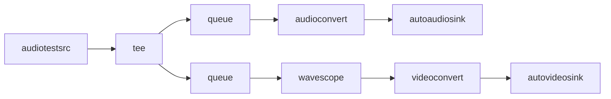

关键点：

- `tee` 的输出 pad 是 request pad。
- 每个分支前都应该放 `queue`。
- `queue` 创建线程边界，避免分支互相阻塞。
- request pad 用完要释放。

代码重点：

```c
tee_pad = gst_element_request_pad_simple (tee, "src_%u");
queue_pad = gst_element_get_static_pad (queue, "sink");
gst_pad_link (tee_pad, queue_pad);

gst_element_release_request_pad (tee, tee_pad);
gst_object_unref (tee_pad);
```

### 模式 5: appsrc / appsink 短接管线

适合应用自己产生数据，或从 pipeline 中取出数据。

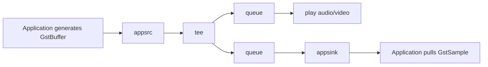

关键点：

- `appsrc` 让应用成为 source。
- `appsink` 让应用成为 sink。
- 必须给 `appsrc` 设置正确 caps。
- buffer 需要 timestamp 和 duration。
- 用 `need-data` / `enough-data` 做流控。
- `appsink` 设置 `emit-signals=true` 后可以接收 `new-sample`。

## Pad Availability 知识图

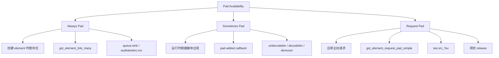

选择方式：

| Pad 类型 | 什么时候出现 | 如何处理 |
| --- | --- | --- |
| Always | element 创建后就有 | 直接 `gst_element_link()` |
| Sometimes | 运行时动态创建 | 监听 `pad-added` |
| Request | 应用按需请求 | `gst_element_request_pad_simple()`，用完释放 |

## Caps 与协商

Caps 是理解 GStreamer 的分水岭。

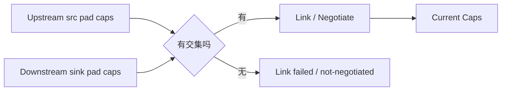

几个重要概念：

| 概念 | 含义 |
| --- | --- |
| Pad Template Caps | element 类型理论上支持什么 |
| Query Caps | 当前状态下 pad 可接受什么 |
| Current Caps | 已经协商出来、正在实际使用的格式 |
| Caps Filter | 应用主动限制某段链路的数据格式 |

典型 caps：

```text
audio/x-raw,format=S16LE,rate=44100,channels=2
video/x-raw,format=I420,width=1920,height=1080,framerate=30/1
video/x-h264,profile=high
```

排查 caps 问题优先用：

```sh
gst-launch-1.0 -v ...
gst-inspect-1.0 ELEMENT
GST_DEBUG=2,GST_CAPS:6 ...
```

## State 状态机

GStreamer pipeline 的状态不是简单“开始/停止”，而是四层状态机。

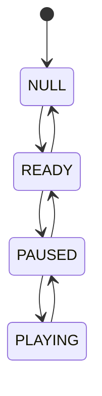

| 状态 | 含义 |
| --- | --- |
| `NULL` | 初始状态，资源释放 |
| `READY` | 准备资源，但没有打开流或 preroll |
| `PAUSED` | 已经 preroll，可查询 duration/position，等待播放 |
| `PLAYING` | 数据按时钟流动，真实播放 |

关键点：

- 查询 position/duration 通常在 `PAUSED` 或 `PLAYING` 后更可靠。
- live stream 可能返回 `GST_STATE_CHANGE_NO_PREROLL`。
- 出错或 EOS 后常切到 `READY` 或 `NULL`。
- 释放 pipeline 前应先设为 `NULL`。

## Bus / Message 知识图

Bus 是 element 向应用层报告事件的通道。

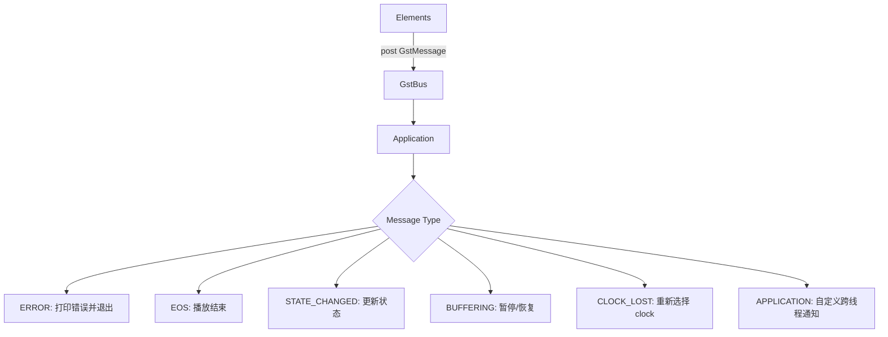

常见处理：

| Message | 常见动作 |
| --- | --- |
| `ERROR` | 解析错误、打印 debug、退出或重试 |
| `EOS` | 停止播放、退出或回到开头 |
| `STATE_CHANGED` | 只关心 pipeline/playbin 自己的状态变化 |
| `DURATION` | duration 缓存失效，后续重新 query |
| `BUFFERING` | 点播流低于 100% 暂停，到 100% 继续 |
| `CLOCK_LOST` | `PAUSED -> PLAYING` 重新选 clock |
| `APPLICATION` | 从 streaming thread 安全通知 main thread |

两种 bus 使用模式：

```text
阻塞等待:
gst_bus_timed_pop_filtered()

事件驱动:
gst_bus_add_signal_watch()
g_signal_connect(bus, "message::error", ...)
```

## Query / Event 知识图

Query 是应用向 pipeline 问问题；event 是应用或 element 向 pipeline 发命令。

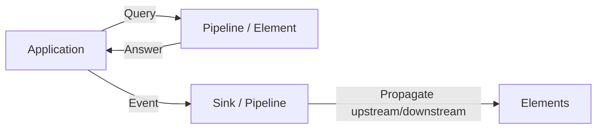

常见 Query：

| Query | API | 用途 |
| --- | --- | --- |
| Position | `gst_element_query_position()` | 当前播放到哪里 |
| Duration | `gst_element_query_duration()` | 总时长 |
| Seeking | `gst_query_new_seeking()` | 是否支持 seek，可 seek 范围 |
| Caps | `gst_pad_query_caps()` | 当前可接受 caps |

常见 Event：

| Event | API | 用途 |
| --- | --- | --- |
| Seek | `gst_element_seek_simple()` / `gst_event_new_seek()` | 跳转、变速、倒放 |
| Step | `gst_event_new_step()` | 单帧推进 |
| EOS | `gst_event_new_eos()` | 通知结束输入 |

## Seek 与播放速度

普通 seek：

```text
跳到 30s:
gst_element_seek_simple(..., 30 * GST_SECOND)
```

变速 seek：

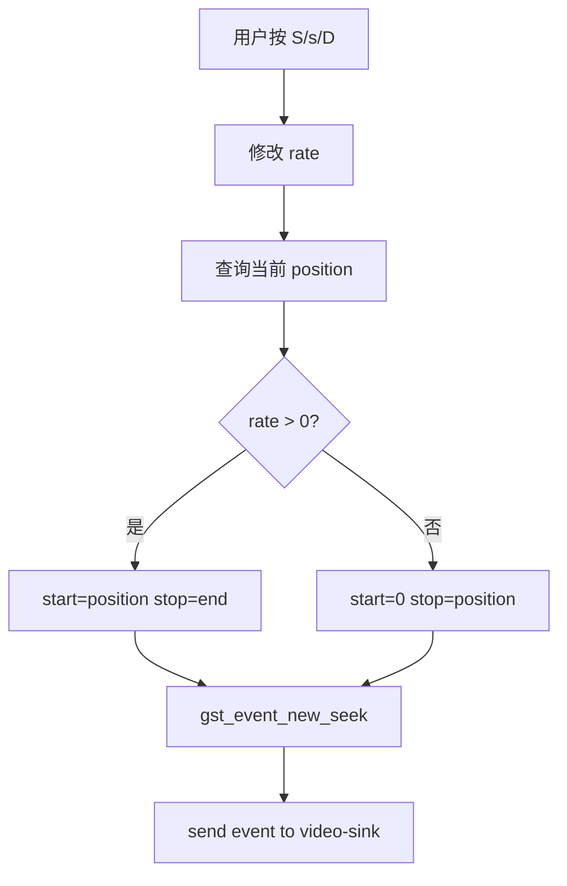

rate 含义：

| Rate | 含义 |
| --- | --- |
| `1.0` | 正常正向播放 |
| `2.0` | 2 倍速 |
| `0.5` | 半速 |
| `-1.0` | 正常倒放 |
| `-2.0` | 2 倍速倒放 |

关键点：

- `rate` 的绝对值表示速度。
- `rate` 的正负表示方向。
- 变速不是设置属性，而是发送 seek event。
- 反向播放时 start 仍应小于 stop，方向由负 rate 表示。

## Streaming 播放流程

网络播放和本地文件播放的核心区别：数据到达速度不稳定。

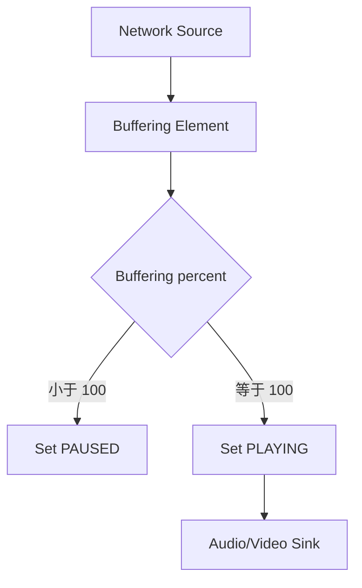

处理逻辑：

```c
if (percent < 100)
  gst_element_set_state (pipeline, GST_STATE_PAUSED);
else
  gst_element_set_state (pipeline, GST_STATE_PLAYING);
```

live stream 例外：

- live stream 通常没有普通点播意义上的“缓冲到 100%”。
- `GST_STATE_CHANGE_NO_PREROLL` 常用于识别 live stream。
- live stream 一般不按点播逻辑处理 buffering。

## GUI 集成与线程安全

GUI 应用中要注意：GStreamer 回调可能运行在 streaming thread，而 GTK/Qt 等 UI 工具包通常要求只能在主线程更新 UI。

安全模式：

```mermaid
sequenceDiagram
  participant GST as GStreamer Thread
  participant BUS as GstBus
  participant MAIN as Main/UI Thread
  participant UI as GTK/Qt UI

  GST->>GST: tags_cb / streaming callback
  GST->>BUS: post APPLICATION message
  BUS->>MAIN: message::application
  MAIN->>UI: update widgets
```

Basic Tutorial 5 就使用了这个模式：

- `tags_cb()` 中不直接更新 GTK。
- 它向 bus 投递 `GST_MESSAGE_APPLICATION`。
- `application_cb()` 在主线程中更新文本控件。

## 媒体信息探测

`GstDiscoverer` 用来在播放前探测媒体。

```mermaid
flowchart TD
  A[URI] --> B[GstDiscoverer]
  B --> C{Result}
  C -->|OK| D[Duration]
  C -->|OK| E[Seekable]
  C -->|OK| F[Tags]
  C -->|OK| G[Stream Topology]
  C -->|Missing Plugins| H[Report plugin info]
  C -->|Error/Timeout| I[Cannot play]
```

适合场景：

- 媒体库扫描。
- 播放前检查是否可播放。
- 获取时长、codec、分辨率、音轨、字幕。
- 提示缺少插件。

命令行版本：

```sh
gst-discoverer-1.0 URI -v
```

## 工程调试图谱

```mermaid
flowchart TD
  A[Pipeline 不工作] --> B{能用 gst-launch 复现吗}
  B -->|能| C[管线/插件/caps/数据源问题]
  B -->|不能| D[应用代码/状态/线程问题]

  C --> E[gst-inspect 查看 element]
  C --> F[gst-launch -v 查看 caps]
  C --> G[GST_DEBUG=2 看错误警告]
  C --> H[GST_CAPS/GST_PADS 深挖]
  C --> I[DOT graph 看拓扑]

  D --> J[检查 bus message]
  D --> K[检查状态切换]
  D --> L[检查引用释放]
  D --> M[检查 UI 线程]
```

常用命令：

```sh
gst-inspect-1.0 ELEMENT
gst-launch-1.0 -v ...
gst-discoverer-1.0 URI -v
GST_DEBUG=2 ./app
GST_DEBUG=2,GST_CAPS:6,GST_PADS:6 ./app
GST_DEBUG_DUMP_DOT_DIR=/tmp/gst-dot ./app
dot -Tpng pipeline.dot -o pipeline.png
```

## 常用 Element 分组

### 高级 Bin

| Element | 用途 |
| --- | --- |
| `playbin` | 完整播放器 |
| `uridecodebin` | 从 URI 自动读取并解码到 raw media |
| `decodebin` | 自动 demux/parse/decode |

### Source / Sink

| Element | 用途 |
| --- | --- |
| `filesrc` / `filesink` | 文件输入输出 |
| `souphttpsrc` | HTTP/HTTPS 输入 |
| `videotestsrc` / `audiotestsrc` | 测试媒体源 |
| `autovideosink` / `autoaudiosink` | 自动选择平台 sink |
| `fakesink` | 吞掉数据，调试前半段 |

### 转换与适配

| Element | 用途 |
| --- | --- |
| `videoconvert` | 视频像素格式/颜色空间转换 |
| `videoscale` | 视频缩放 |
| `videorate` | 视频帧率规整 |
| `audioconvert` | 音频采样格式/声道布局转换 |
| `audioresample` | 音频采样率转换 |
| `audiorate` | 修正音频时间连续性 |

### 分支与线程

| Element | 用途 |
| --- | --- |
| `queue` | 缓冲并创建线程边界 |
| `queue2` | 支持 streaming buffering |
| `multiqueue` | 多路流队列管理 |
| `tee` | 一路拆多路 |

### 应用接入与调试

| Element | 用途 |
| --- | --- |
| `appsrc` | 应用向 pipeline 注入数据 |
| `appsink` | 应用从 pipeline 取出数据 |
| `identity` | 原样通过，插入观察点 |
| `capsfilter` | 限制 caps |
| `typefind` | 识别媒体类型 |

## 平台相关选择

一般优先使用：

```text
autovideosink
autoaudiosink
playbin
```

需要手动指定时：

| 平台 | 视频 | 音频 |
| --- | --- | --- |
| Linux | `glimagesink`、`ximagesink`、`xvimagesink` | `pulsesink`、`alsasink` |
| Windows | `d3d11videosink` | `wasapi2sink`、`wasapisink` |
| macOS | `osxvideosink`、`glimagesink` | `osxaudiosink` |
| Android | `glimagesink`、`ahcsrc` | `openslessink`、`openslessrc` |
| iOS | `glimagesink` | `osxaudiosink` |

排查自动选择：

```sh
GST_DEBUG=2,autodetect*:5 gst-launch-1.0 videotestsrc ! autovideosink
```

## 编程技巧清单

### 创建与连接

- 每次 `gst_element_factory_make()` 后都检查返回值。
- 先 `gst_bin_add_many()`，再 `gst_element_link_many()`。
- 静态链路用 `gst_element_link_many()`。
- 动态 pad 用 `pad-added` 回调。
- request pad 用 `gst_element_request_pad_simple()`，用完 `gst_element_release_request_pad()`。

### Caps

- link 失败先看上下游 pad template caps。
- 不确定格式时加入 `videoconvert` / `audioconvert`。
- 需要固定尺寸/采样率/帧率时用 capsfilter。
- 运行时 caps 用 `gst-launch -v` 或 `GST_CAPS:6` 看。

### 状态与查询

- position/duration 查询在 `PAUSED` 或 `PLAYING` 后更可靠。
- duration 变化时把缓存标记为无效，后续再 query。
- seek 前先检查是否支持 seeking。
- release 前把 pipeline 设置为 `NULL`。

### Bus

- 总是处理 `ERROR` 和 `EOS`。
- GUI 程序更适合 `gst_bus_add_signal_watch()`。
- CLI 简单 demo 可以用 `gst_bus_timed_pop_filtered()`。
- 复杂应用中，状态、buffering、clock lost、application message 都值得处理。

### 线程与 UI

- 不要在 GStreamer streaming thread 里直接更新 UI。
- 用 bus application message 或主循环调度把工作转回 UI thread。
- 多分支 pipeline 里每个 tee 分支前放 queue。

### appsrc / appsink

- `appsrc` 必须设置 caps。
- 手写 buffer 时设置 timestamp 和 duration。
- 用 `need-data` / `enough-data` 控制 push 节奏。
- `appsink` 要发 `new-sample`，需设置 `emit-signals=true`。
- 用完 `GstBuffer`、`GstSample` 记得 unref。

### 调试

- 第一层：`GST_DEBUG=2`。
- 第二层：`gst-launch-1.0 -v` 看 caps。
- 第三层：`GST_CAPS:6`、`GST_PADS:6`、`decodebin*:5`。
- 第四层：导出 DOT 图。
- 不确定 element 属性和 pad 时，先 `gst-inspect-1.0 ELEMENT`。

## 常见问题到解决路径

| 问题 | 优先检查 |
| --- | --- |
| element 创建失败 | 插件是否安装，`gst-inspect-1.0 ELEMENT` |
| `gst_element_link()` 失败 | pad template caps 是否有交集 |
| `not-negotiated` | capsfilter、convert/resample/scale 是否缺失 |
| 没声音 | audio sink、caps、volume、是否 EOS/ERROR |
| 没画面 | video sink、窗口系统、videoconvert、caps |
| 动态 pad 没连上 | 是否监听 `pad-added`，caps 是否匹配 |
| tee 分支卡住 | 每个分支前是否有 queue |
| 网络播放卡顿 | 是否处理 `BUFFERING` |
| 直播行为异常 | 是否识别 `NO_PREROLL` |
| GUI 崩溃或卡住 | 是否跨线程更新 UI |
| 倍速/倒放不生效 | 媒体/decoder/demuxer 是否支持 trick mode |
| appsrc 无数据 | caps、timestamp、need-data 流控 |
| appsink 没回调 | `emit-signals`、caps、是否有数据到达 |

## 最小心智模型

如果只记一张图，可以记这个：

```mermaid
flowchart TD
  A[Source 产生 Buffer] --> B[Pad 连接]
  B --> C[Caps 协商]
  C --> D[Element 处理]
  D --> E[Sink 消费]

  F[Application] -->|set_state| G[Pipeline State]
  F -->|query| H[Position / Duration / Caps]
  F -->|event| I[Seek / Step / EOS]
  G --> J[Bus Message]
  H --> F
  I --> D
  J --> F
```

这张图包含了 GStreamer 应用的几乎所有基本交互：

- 数据面：source -> pad -> caps -> element -> sink。
- 控制面：application -> state/query/event。
- 反馈面：element -> bus message -> application。

## 总结

GStreamer Basic Tutorial 系列最终教你的不是某一条固定 pipeline，而是一套搭建和调试媒体系统的方法：

1. 先用 `playbin` 快速确认媒体能不能播放。
2. 需要控制时，拆成 source/filter/sink 手动搭建。
3. 遇到动态媒体结构，理解 pad availability。
4. 遇到格式问题，回到 caps negotiation。
5. 遇到运行时控制，使用 state、query、event。
6. 遇到多分支和阻塞，使用 tee、queue、multiqueue。
7. 需要接入应用数据，用 appsrc/appsink。
8. 需要播放前分析，用 GstDiscoverer。
9. 需要工程化，掌握工具、调试和平台相关 element。

掌握这些点以后，再看复杂 GStreamer 项目时，就不会只看到一串 element 名字，而能看见它背后的结构：数据从哪里来，格式如何协商，线程在哪里切开，应用如何控制，错误如何反馈，以及该从哪里下手调试。
