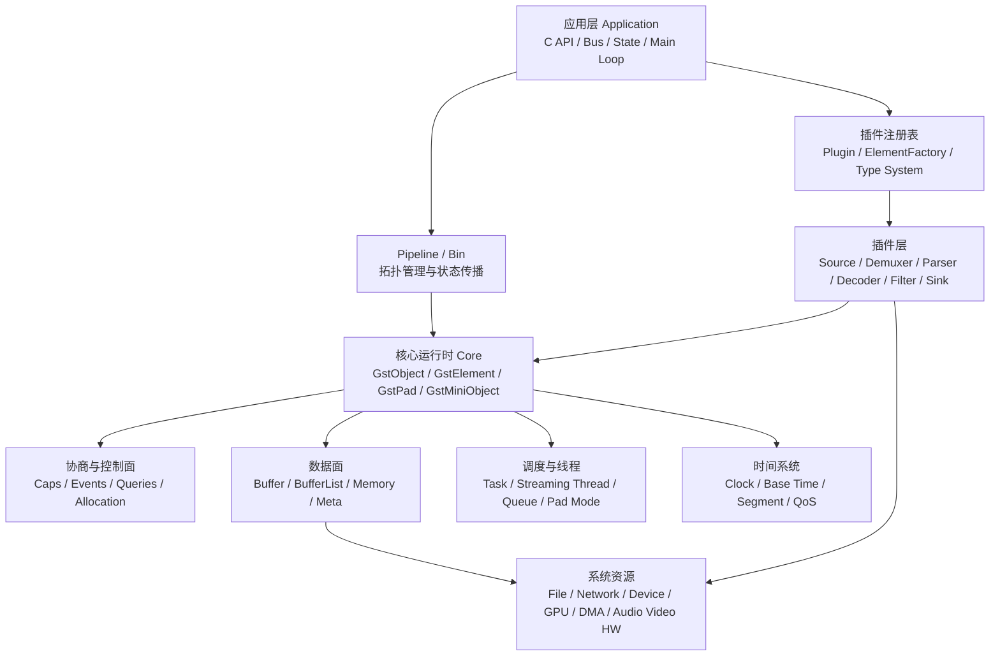
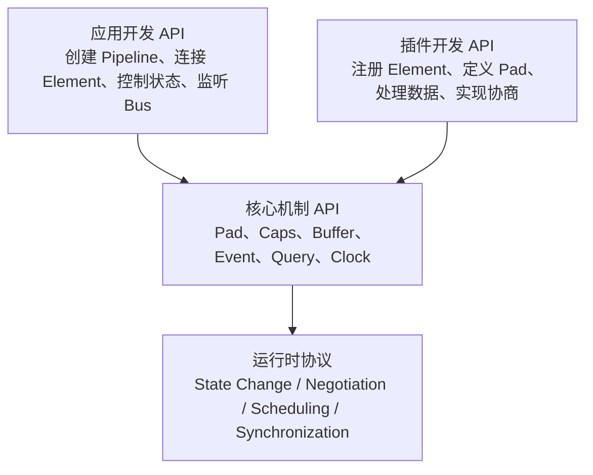
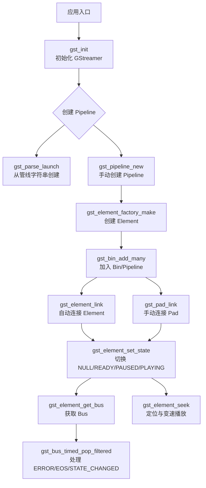
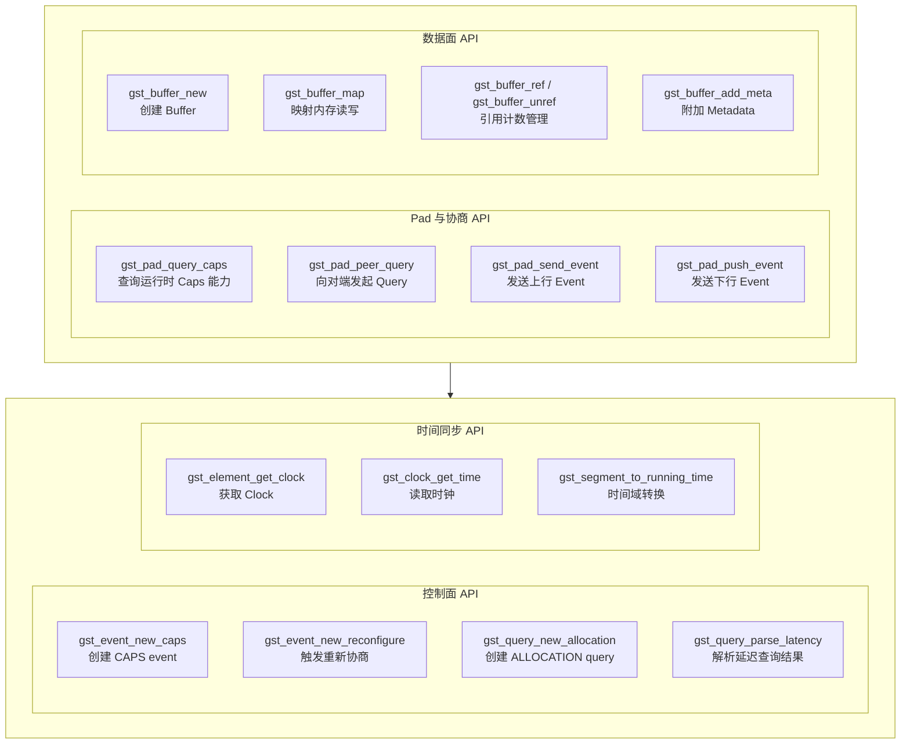
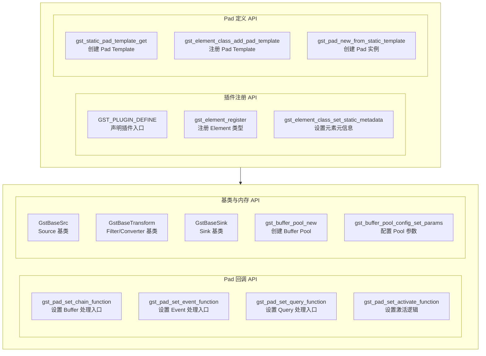
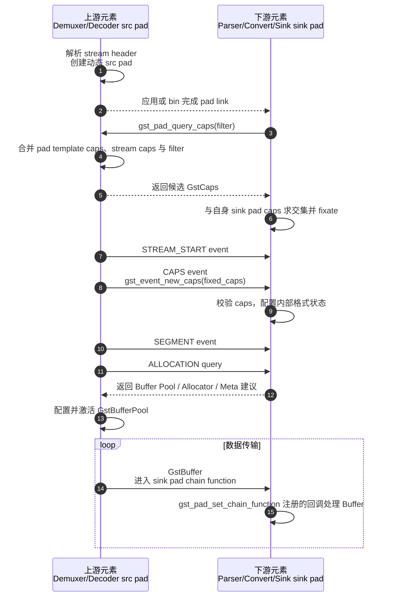
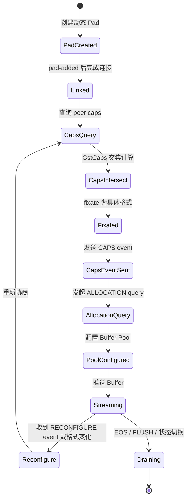

# GStreamer 多媒体框架技术架构设计文档

## 1. 文档定位

本文面向具备 C 语言基础、多媒体基础和一定工程经验的中高级开发者，目标是从系统架构和软件开发两个视角理解 **GStreamer** 的核心设计、运行机制、应用开发模式和插件开发模型。

本文采用“总-分-总”的分析方式：

1. 总览：先建立 **GStreamer** 的系统边界、核心抽象、模块关系和 API 全景。
2. 分解：分别展开核心机制、应用开发实践和插件开发深度主题。
3. 总结：最后给出架构取舍、工程建议和常见风险点。

## 2. 总体架构概览

**GStreamer** 是一个基于插件的流式多媒体处理框架。它把采集、解封装、解析、解码、转换、编码、封装、传输和播放等能力抽象为可连接的处理节点，即 **Element**。应用通过把多个 **Element** 组织成 **Pipeline**，形成端到端的数据流处理图。

从架构上看，**GStreamer** 的关键价值不在于提供某一个固定播放器，而在于提供一套通用的媒体数据流执行引擎：

- 用 **Pipeline** 表达媒体处理拓扑。
- 用 **Pad** 表达节点之间的数据端口。
- 用 **Caps** 表达媒体格式能力与约束。
- 用 **Buffer** 承载媒体数据。
- 用 **Event** 和 **Query** 承载控制面交互。
- 用 **Clock** 和 **Segment** 保证时间同步。
- 用插件体系把媒体处理能力动态扩展到不同格式、协议和硬件平台。

### 2.1 模块总览图



### 2.2 核心模块与职责

| 模块 | 主要对象 | 职责 |
| --- | --- | --- |
| 对象与类型系统 | **GObject**、**GstObject** | 提供引用计数、属性、信号、类型注册和对象生命周期管理。 |
| 拓扑管理 | **GstPipeline**、**GstBin**、**GstElement** | 管理媒体处理图，处理状态切换、子元素组织和消息聚合。 |
| 端口与连接 | **GstPad**、**GstPadTemplate** | 表达输入输出端口，负责链路连接、数据推送、事件传播、查询处理和调度模式。 |
| 格式协商 | **GstCaps**、**GstStructure** | 描述媒体类型、字段约束和交集计算，是连接与运行时格式确定的基础。 |
| 数据承载 | **GstBuffer**、**GstMemory**、**GstBufferPool** | 承载媒体数据、内存块、时间戳、引用关系和复用策略。 |
| 控制面 | **GstEvent**、**GstQuery**、**GstMessage** | 在元素之间传递流控制、定位、重新配置、能力查询和异步消息。 |
| 时间同步 | **GstClock**、**GstSegment** | 建立全局播放时间、流时间、运行时间之间的映射，并驱动音视频同步。 |
| 调度执行 | **GstTask**、Pad 激活模式、**queue** | 控制 push/pull 模式、流线程、线程边界和背压传播。 |
| 插件体系 | **GstPlugin**、**GstElementFactory** | 加载插件、注册元素工厂、按名称创建具体处理节点。 |
| 调试与观测 | **GST_DEBUG**、Tracer、Bus | 支持日志、性能追踪、状态消息和错误诊断。 |

### 2.3 API 总览图

原始 API 全景如果全部放在一张横向图中，容易因为节点过多而缩小。这里按阅读路径拆成四张图：第一张说明 API 层次关系，后三张分别展开应用开发、核心机制和插件开发 API。

#### 2.3.1 API 分层关系图



#### 2.3.2 应用开发 API 图



#### 2.3.3 核心机制 API 图



#### 2.3.4 插件开发 API 图



## 3. 核心抽象与执行模型

### 3.1 Element、Pad 与 Pipeline

**Element** 是处理单元，可能是源、过滤器、转换器、编解码器、复用器或输出设备。**Pad** 是 **Element** 的输入输出端口，分为 **src pad** 和 **sink pad**。**Pipeline** 是特殊的 **Bin**，用于承载完整处理图，并提供全局时钟选择、状态管理和总线消息。

典型链路如下：

```text
filesrc -> qtdemux -> h264parse -> avdec_h264 -> videoconvert -> autovideosink
```

该链路中，数据面沿 **src pad** 到 **sink pad** 向下游流动；控制面可能沿上游或下游传播。例如 **CAPS event** 通常下行，**LATENCY query** 和 **ALLOCATION query** 通常通过查询机制在相关方向上传递。

### 3.2 Push 模式与 Pull 模式

**GStreamer** 支持两类典型调度模式：

| 模式 | 说明 | 常见场景 |
| --- | --- | --- |
| **Push Mode** | 上游主动产生 **Buffer** 并调用下游 chain 函数。 | 实时采集、网络流、常规解码播放。 |
| **Pull Mode** | 下游按需从上游拉取数据，通常通过 range-based 访问实现。 | 文件解封装、随机访问、索引读取。 |

多数应用开发者首先接触的是 **Push Mode**。在插件开发中，必须理解 pad 激活、任务创建和调度模式，否则容易出现线程阻塞、状态切换死锁或无法 seek 的问题。

## 4. 核心机制与高级概念

### 4.1 衬垫协商：Caps Negotiation

**Caps Negotiation** 的目标是让相邻元素在某条 pad 链路上确定一个双方都能处理的媒体格式。**GstCaps** 是能力集合，内部由一个或多个 **GstStructure** 组成。每个 structure 描述媒体类型和字段约束，例如：

```text
video/x-raw, format=NV12, width=1920, height=1080, framerate=30/1
```

协商通常包含以下阶段：

1. 能力发现：通过 pad template caps、`gst_pad_query_caps()` 或元素自定义 query 函数获取可支持集合。
2. 交集计算：使用 **GstCaps** 交集、过滤和 fixate 机制收敛到具体格式。
3. 下发格式：上游通过 **CAPS event** 把最终 caps 发送给下游。
4. 分配协商：通过 **ALLOCATION query** 协商 **Buffer Pool**、allocator 和 metadata。
5. 数据传输：上游按照已协商 caps 产生 **Buffer**。

`gst_pad_query_caps()` 的职责是查询某个 pad 在当前上下文下可接受的 caps。它不是简单读取静态模板，而是会结合 peer、filter、当前状态和元素自定义 query 逻辑返回更贴近运行时的能力集合。

`gst_pad_set_chain_function()` 的职责是为 sink pad 设置 **Push Mode** 下接收 **Buffer** 的回调函数。协商完成之后，上游推送的每个 **GstBuffer** 通常会进入该 chain 函数，插件在这里完成解析、转换、过滤或转发。

### 4.2 动态衬垫协商：Dynamic Pad Negotiation

**Dynamic Pad Negotiation** 常见于解封装器、自动解码器和多路流元素，例如 **qtdemux**、**matroskademux**、**decodebin**、**uridecodebin**。这些元素在创建时并不知道真实媒体流有几路音频、几路视频或字幕，因此会在解析到流信息后动态创建 **sometimes pad**。

#### 4.2.1 内部流程

动态协商可以拆成两个层面：

- 拓扑层：元素根据输入数据发现新 stream，创建动态 **src pad**，发出 `pad-added` 信号，应用或 **decodebin** 内部逻辑完成连接。
- 媒体层：新 pad 与下游 pad 连接后，通过 **GstCaps** 查询、交集、fixate、**CAPS event** 和 **ALLOCATION query** 完成格式与内存策略协商。

典型流程如下：

1. 上游 demuxer 接收容器数据并解析 stream header。
2. demuxer 为新 stream 创建动态 **src pad**，其 pad template 通常是 `audio_%u`、`video_%u` 或 `src_%u`。
3. demuxer 在新 pad 上设置 caps，或准备在后续数据前发送 **CAPS event**。
4. 应用收到 `pad-added` 信号，选择合适的下游元素并调用 `gst_pad_link()` 或 `gst_element_link_pads()`。
5. 链接过程中或链接后，下游通过 `gst_pad_query_caps()` 暴露可接受格式。
6. 上游计算交集并 fixate 到具体 caps。
7. 上游发送 **STREAM_START event**、**CAPS event**、**SEGMENT event**。
8. 上游发起 **ALLOCATION query**，下游返回推荐的 **GstBufferPool**、allocator、alignment 和 metadata 支持情况。
9. 上游激活或配置 **Buffer Pool**，开始推送 **GstBuffer**。

#### 4.2.2 两个元素间完整协商时序图



#### 4.2.3 协商状态流转图



#### 4.2.4 GstCaps 交互机制

**GstCaps** 的交互不是单次函数调用，而是一组查询、事件和状态更新共同形成的协议：

- pad template caps 提供元素类型层面的静态能力。
- `gst_pad_query_caps()` 提供运行时能力查询入口，可以带 filter 限制候选范围。
- **ACCEPT_CAPS query** 用于快速判断某个 caps 是否可接受。
- **CAPS event** 用于把已经确定的 caps 作为流状态下发。
- 元素内部会缓存当前 caps，并在 chain、transform、render 等路径中按当前格式解释 **Buffer**。

对于转换类元素，sink caps 和 src caps 之间可能存在映射关系。例如视频转换元素的 sink pad 接收 `I420`，src pad 根据下游能力选择 `NV12` 或 `RGBA`。这类元素的 query 函数需要同时考虑上下游约束，不能只返回静态全集。

#### 4.2.5 重新协商触发条件与实现路径

**Re-negotiation** 是运行中重新确定 caps 和分配策略的过程。常见触发条件包括：

| 触发条件 | 示例 | 典型处理 |
| --- | --- | --- |
| 输入格式变化 | 自适应码流分辨率变化、音频采样率变化 | 上游发送新的 **CAPS event**，必要时重配 pool。 |
| 下游能力变化 | 视频窗口尺寸变化、硬件 sink 切换格式 | 下游向上游发送 **RECONFIGURE event**。 |
| 插入或移除元素 | 动态添加 filter、tee 分支 | 暂停相关分支，重新 query caps 并 relink。 |
| seek 或 segment 变化 | 跳转到不同编码参数片段 | flush 后重新发送 stream-start、caps、segment。 |
| 硬件资源变化 | DMA buffer 不可用、设备重启 | 重新发起 **ALLOCATION query** 并降级到系统内存。 |

实现路径通常如下：

1. 下游发现当前格式或内存策略不再适合，向上游发送 **RECONFIGURE event**。
2. 上游停止继续假设旧 caps，标记需要重新协商。
3. 下一次产生数据前，上游通过 `gst_pad_query_caps()` 查询下游当前能力。
4. 上游计算新的固定 caps，发送新的 **CAPS event**。
5. 如果内存布局、stride、metadata 或 allocator 发生变化，上游重新执行 **ALLOCATION query**。
6. 上游停用旧 **Buffer Pool**，配置并启用新 pool。
7. 数据面恢复，新的 **Buffer** 必须满足新的 caps 和 allocation 约束。

#### 4.2.6 Buffer Pool 在动态协商中的作用

**GstBufferPool** 是协商中容易被低估的部分。caps 只描述“数据是什么格式”，而 **Buffer Pool** 决定“这些数据如何被分配、复用和传递”。

在高性能视频链路中，**Buffer Pool** 通常承担以下职责：

- 复用固定数量的 **GstBuffer**，减少频繁分配释放。
- 约束 buffer size、stride、padding 和 alignment。
- 绑定特定 allocator，例如系统内存、DMA-BUF、GL memory、VA memory。
- 声明需要附带的 **GstMeta**，例如 video meta、crop meta、protection meta。
- 让硬件 source、decoder、converter 和 sink 共享零拷贝路径。

因此，动态协商不应只关注 `GstCaps` 是否匹配。对于硬件加速链路，caps 匹配但 allocator 或 meta 不匹配，仍然可能导致额外拷贝、性能下降，甚至运行失败。

### 4.3 缓冲区与缓冲池：Buffer & Bufferpool

**GstBuffer** 是数据面基本单位，内部可包含多个 **GstMemory**。它不仅承载数据指针，还承载时间戳、duration、offset、flags 和 metadata。

关键概念：

- **PTS**：Presentation Timestamp，表示展示时间。
- **DTS**：Decode Timestamp，表示解码时间。
- **Duration**：buffer 持续时间。
- **GstMemory**：实际内存块，可来自系统内存、共享内存、DMA 或 GPU。
- **GstMeta**：附加结构化元数据，如视频 stride、裁剪区域、HDR 信息。
- **GstBufferPool**：批量分配和复用 buffer 的对象。

插件中常见实践是：在协商阶段处理 **ALLOCATION query**，在处理阶段从 pool 获取 buffer，填充数据后推送给下游。转换类插件还需要谨慎处理 in-place 与 out-of-place 两种模式。

### 4.4 多线程与调度：Threads & Scheduling

**GStreamer** 的线程模型不是“每个元素一个线程”。线程边界由调度模式和特定元素共同决定，最常见的是 **queue**、**multiqueue**、source task 和 sink 内部线程。

典型规则：

- 没有 **queue** 的 push 链路通常在同一个 streaming thread 中串行执行。
- **queue** 会把上游 push 与下游消费拆成两个线程，并形成缓冲与背压边界。
- **tee** 后多分支通常每个分支都需要 **queue**，否则一个慢分支可能阻塞所有分支。
- source 类元素通常创建 task 主动产生数据。
- pull 模式中，下游可能驱动上游按范围读取。

线程设计的核心不是盲目增加并发，而是控制阻塞传播、延迟、吞吐和内存占用。

### 4.5 事件与查询：Events & Queries

**Event** 是沿 pad 传播的控制消息，常用于改变流状态；**Query** 是同步问答机制，常用于查询能力、位置、时长、延迟和分配策略。

常见 **Event**：

| Event | 方向 | 作用 |
| --- | --- | --- |
| **STREAM_START** | 下行 | 标识新流开始。 |
| **CAPS** | 下行 | 通知当前媒体格式。 |
| **SEGMENT** | 下行 | 定义流时间片段与播放速率。 |
| **EOS** | 下行 | 表示流结束。 |
| **FLUSH_START / FLUSH_STOP** | 双向相关 | 清空阻塞和旧数据，常用于 seek。 |
| **RECONFIGURE** | 上行 | 请求上游重新协商。 |
| **QOS** | 上行 | 反馈下游处理延迟和丢帧压力。 |

常见 **Query**：

| Query | 作用 |
| --- | --- |
| **CAPS** | 查询 pad 当前可支持 caps。 |
| **ACCEPT_CAPS** | 判断某个 caps 是否可接受。 |
| **ALLOCATION** | 协商 buffer pool、allocator 和 meta。 |
| **LATENCY** | 查询链路延迟。 |
| **POSITION / DURATION** | 查询当前位置和总时长。 |
| **SEEKING** | 查询是否支持 seek。 |

### 4.6 时钟与同步：Clocking & Synchronization

多媒体播放必须处理时间同步。**GStreamer** 使用 **GstClock** 提供统一时钟，使用 base time、running time、stream time 和 segment 建立时间映射。

核心关系：

- **Clock Time**：全局时钟时间。
- **Base Time**：pipeline 进入播放态时设定的基准。
- **Running Time**：`clock_time - base_time`，表示 pipeline 已运行时间。
- **Stream Time**：媒体流内部时间，受 seek、segment 和 rate 影响。
- **PTS**：buffer 应在何时展示，sink 根据 running time 决定等待、渲染或丢弃。

音视频同步通常由 sink 完成。音频 sink 往往是 pipeline clock 的提供者，因为音频设备播放节奏稳定且对人耳敏感。视频 sink 根据时钟决定帧展示时刻，必要时丢帧或等待。

### 4.7 元数据与标签：Metadata & Tagging

**Metadata** 和 **Tag** 解决两个不同问题：

- **GstMeta** 附着在 **GstBuffer** 上，描述单个 buffer 的技术性附加信息，例如视频 plane、stride、裁剪、硬件句柄或保护信息。
- **GstTagList** 描述媒体流或文件的语义信息，例如标题、作者、专辑、语言、旋转角度、封面等。

工程上需要区分二者。逐帧处理相关信息应使用 **GstMeta**；媒体展示、索引和 UI 信息应使用 **Tag** 或 bus message。

## 5. 应用开发与实践主题

### 5.1 动态流水线

动态流水线是应用开发的重点。常见场景包括播放未知媒体、运行时添加录制分支、切换输出设备和根据网络状态调整链路。

关键实践：

- 对 `pad-added` 信号做类型判断，不要盲目 link。
- 动态添加元素时，先 `gst_bin_add()`，再同步状态 `gst_element_sync_state_with_parent()`。
- 修改运行中链路时使用 pad probe 暂停数据流，避免半连接状态下数据进入。
- seek、flush、unlink 和 relink 要考虑 **EOS**、**FLUSH**、**SEGMENT** 的顺序。

### 5.2 缓冲策略

缓冲策略同时影响延迟、吞吐、内存占用和稳定性。

常用元素和策略：

| 场景 | 元素或机制 | 建议 |
| --- | --- | --- |
| 解耦线程 | **queue** | 设置合理的 `max-size-buffers`、`max-size-bytes`、`max-size-time`。 |
| 多路解封装 | **multiqueue** | 避免音视频或多路字幕互相饿死。 |
| 网络播放 | **queue2**、jitterbuffer | 根据码率和网络抖动设置缓存。 |
| 低延迟直播 | leaky queue、低 latency sink | 明确允许丢帧，避免无限累积延迟。 |
| 硬件链路 | **Buffer Pool**、allocator | 优先保持零拷贝，避免隐式 map 到 CPU。 |

缓冲不是越多越好。实时交互场景要优先控制端到端延迟；离线转码场景则更关注吞吐和稳定性。

### 5.3 流复制

流复制通常使用 **tee**。典型结构如下：

```text
source -> decode -> tee
                  -> queue -> display
                  -> queue -> encoder -> muxer -> filesink
```

设计原则：

- **tee** 的每个分支后面通常都应放置 **queue**。
- 分支之间的时钟同步、阻塞和错误处理要隔离。
- 录制分支如果可能阻塞磁盘，应设置 leaky 或异步写入策略。
- 动态移除分支时，先阻塞 tee src pad，再发送 EOS 或 flush，最后 unlink 并释放 request pad。

### 5.4 接口与动态参数

应用可以通过 **GObject property**、信号、接口和 bus message 与元素交互。

常见方式：

- `g_object_set()` / `g_object_get()` 设置元素属性。
- 监听 bus 上的 **ERROR**、**EOS**、**STATE_CHANGED**、**TAG**、**BUFFERING** 消息。
- 使用 **GstChildProxy** 修改 bin 内部子元素属性。
- 使用 **GstPreset** 保存和加载参数预设。
- 对实时参数变更，确认该属性是否支持运行态修改；否则需要切换状态或重新协商。

## 6. 插件开发深度主题

### 6.1 插件类型选择

插件开发不一定从裸 **GstElement** 开始。优先选择基类可以减少错误：

| 基类 | 适用场景 |
| --- | --- |
| **GstBaseSrc** | 数据源、采集设备、文件或网络输入。 |
| **GstPushSrc** | 主动 push 数据的 source。 |
| **GstBaseTransform** | 一进一出的过滤、转换、分析元素。 |
| **GstVideoFilter** / **GstAudioFilter** | 音视频 raw 数据处理。 |
| **GstBaseSink** | 输出设备、渲染器、写文件或发送网络。 |
| **GstAggregator** | 多输入聚合，如混音、合成、mux 前处理。 |

基类已经处理了大量状态切换、事件、查询、segment、flush 和 QoS 细节。只有在调度模型非常特殊时，才建议直接继承 **GstElement**。

### 6.2 高级调度与 Pad 设计

插件的 pad 设计决定了它能否正确参与系统调度。

需要重点设计：

- pad template 的方向、名称、presence 和 static caps。
- sink pad 的 chain function、event function 和 query function。
- src pad 的 caps query、allocation query 和 activate mode。
- request pad 的创建、释放和生命周期。
- sometimes pad 的创建时机、stream-start 顺序和 no-more-pads 信号。

`gst_pad_set_chain_function()` 用于绑定 sink pad 的数据入口。一个自定义 filter 通常在 class/init 阶段创建 sink pad，并设置 chain function：

```c
gst_pad_set_chain_function (filter->sinkpad, gst_my_filter_chain);
```

`gst_pad_query_caps()` 常用于连接前或重新协商时主动查询 peer 能力：

```c
GstCaps *peer_caps = gst_pad_query_caps (srcpad, filter_caps);
```

二者在流程中的职责不同：前者服务数据面处理，后者服务协商控制面。优秀插件必须同时正确处理这两条路径。

### 6.3 插件协商函数设计

插件需要为 query 和 event 提供一致的语义：

- sink pad 收到 **CAPS event** 时，校验格式并更新内部处理参数。
- query caps 时，返回当前状态下真实可支持的 caps，而不是无条件返回全集。
- 转换元素应实现 sink caps 到 src caps 的映射，以及 src caps 到 sink caps 的反向约束。
- 收到 **RECONFIGURE event** 后，应清理旧假设，触发新的 caps query 和 allocation query。
- 对硬件插件，allocation query 必须准确描述 allocator、pool、meta 和 alignment 需求。

### 6.4 内存与零拷贝

高性能插件开发的关键是内存模型。常见路径包括：

- 系统内存：实现简单，但 CPU 拷贝成本高。
- **DMA-BUF**：适合 Linux 视频采集、硬件编解码和显示链路。
- **GL Memory**：适合 GPU 纹理处理和渲染。
- 硬件专用 memory：如 VA、V4L2、平台私有 allocator。

零拷贝设计必须同时满足 caps、allocator、metadata 和设备可访问性。只看到 caps 中写着 `video/x-raw(memory:DMABuf)` 并不意味着整条链路已经零拷贝，还要确认每个元素是否真正接受对应 memory feature。

### 6.5 状态、错误和资源管理

插件必须严格处理状态切换：

- **NULL -> READY**：打开设备、初始化不可变资源。
- **READY -> PAUSED**：准备流资源，可能进行 preroll。
- **PAUSED -> PLAYING**：开始实时调度和时钟同步。
- **PLAYING -> PAUSED**：停止实时推进，但保留可恢复状态。
- **READY -> NULL**：释放设备和外部资源。

错误处理应通过 **GstMessage** 上报到 bus，并尽量携带调试信息。插件内部不要静默吞掉不可恢复错误，否则应用只会表现为卡住或 EOS 异常。

## 7. 工程观测与调试

建议开发者掌握以下工具和方法：

| 工具 | 用途 |
| --- | --- |
| `gst-inspect-1.0` | 查看插件、element、pad template、属性和 caps。 |
| `gst-launch-1.0` | 快速验证管线和插件行为。 |
| `GST_DEBUG` | 打开分类日志，例如 `GST_CAPS:6`、`GST_EVENT:5`。 |
| `GST_DEBUG_DUMP_DOT_DIR` | 导出 pipeline dot 图。 |
| Tracer | 分析 latency、stats、leaks 等运行时问题。 |
| Pad Probe | 观察、阻塞、丢弃或修改经过 pad 的数据和事件。 |

排查协商问题时，优先打开：

```sh
GST_DEBUG=2,GST_CAPS:6,GST_PADS:5,GST_EVENT:5,GST_QUERY:5
```

排查线程和阻塞问题时，重点观察 **queue** 水位、sink 同步、QoS 消息和是否存在未释放的 request pad。

## 8. 架构取舍与设计原则

从资深系统架构师视角看，**GStreamer** 的设计有几个重要取舍：

1. 插件化优先：能力由插件扩展，核心保持稳定抽象。
2. 数据面与控制面分离：**Buffer** 传输媒体数据，**Event/Query/Message** 处理控制信息。
3. 显式协商：caps、allocation、latency 都通过协议协商，而不是由中心调度器硬编码。
4. 局部自治：每个元素独立处理自己的状态、线程和资源，但必须遵守 pad 协议。
5. 可组合性优先：复杂应用由简单元素组合而成，代价是开发者需要理解动态拓扑和协商机制。

这些取舍使 **GStreamer** 同时适合播放器、转码器、流媒体服务器、采集系统、视频会议、嵌入式多媒体和硬件加速场景。

## 9. 总结

**GStreamer** 的本质是一套面向流式媒体处理的组件化运行时。它以 **Element**、**Pad**、**Caps**、**Buffer**、**Event**、**Query**、**Clock** 和插件体系为核心，构建了可扩展、可协商、可调度的多媒体处理框架。

对于应用开发者，重点是掌握动态流水线、pad 连接、bus 消息、缓冲策略、seek 和运行态参数调整。对于插件开发者，重点是正确实现 caps negotiation、allocation query、事件查询处理、线程调度、状态切换和内存管理。

动态衬垫协商是理解 **GStreamer** 的关键入口。它把动态拓扑、**GstCaps**、重新协商、**Buffer Pool** 和 chain function 串联在一起。只要理解了这条路径，就能更系统地分析“为什么 link 失败”“为什么运行中重新协商”“为什么硬件链路发生拷贝”“为什么某个分支阻塞整个 pipeline”等工程问题。

在真实项目中，建议始终把 **GStreamer** 当作一个协议化的数据流系统来设计和调试：先明确数据格式，再明确内存策略，再明确调度边界，最后处理时钟同步和错误恢复。这样构建出来的应用和插件更容易维护，也更能适应复杂媒体场景。
